# 15 Stories from Virginia School Data

``` r
library(vaschooldata)
library(dplyr)
library(tidyr)
library(ggplot2)

theme_set(theme_minimal(base_size = 14))
```

Virginia educates nearly **1.25 million students** across 132 school
divisions and graduates over **90,000 seniors** each year. This package
provides 9 years of enrollment data (2016-2024) and 5 years of
graduation data (2019-2023) directly from the Virginia Department of
Education. Here are fifteen stories hiding in the data.

------------------------------------------------------------------------

## 1. Virginia graduates 92% of its students

Virginia’s four-year graduation rate has held steady between 91.6% and
93.0% over five years, placing it well above the national average of
roughly 87%.

``` r
all_grad <- bind_rows(lapply(2019:2023, function(yr) {
  fetch_graduation(yr, use_cache = TRUE)
}))

state_grad <- all_grad |>
  filter(is_state, diploma_type == "all") |>
  select(end_year, graduation_rate, cohort_size, total_graduates, dropout_rate)

state_grad |>
  mutate(grad_pct = round(graduation_rate * 100, 2),
         dropout_pct = round(dropout_rate * 100, 2))
#> # A tibble: 5 × 7
#>   end_year graduation_rate cohort_size total_graduates dropout_rate grad_pct
#>      <int>           <dbl>       <int>           <int>        <dbl>    <dbl>
#> 1     2019           0.916       98241           89991       0.0551     91.6
#> 2     2020           0.925       98327           90971       0.0509     92.5
#> 3     2021           0.930       97096           90325       0.0425     93.0
#> 4     2022           0.922       98281           90603       0.0515     92.2
#> 5     2023           0.919       98927           90944       0.0538     91.9
#> # ℹ 1 more variable: dropout_pct <dbl>
```

``` r
stopifnot(nrow(state_grad) > 0)

ggplot(state_grad, aes(x = end_year, y = graduation_rate)) +
  geom_line(linewidth = 1.2, color = "#003366") +
  geom_point(size = 3, color = "#003366") +
  scale_y_continuous(labels = scales::percent, limits = c(0.88, 0.96)) +
  labs(
    title = "Virginia 4-Year Graduation Rate (2019-2023)",
    subtitle = "Consistently above 91%, peaking in 2021",
    x = "Cohort Year",
    y = "Graduation Rate"
  )
```

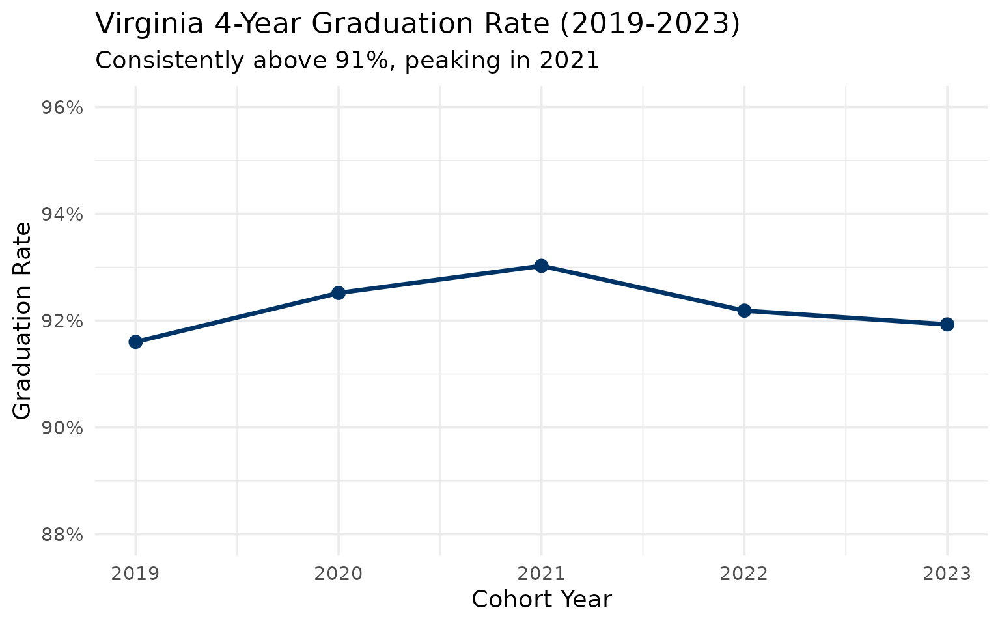

------------------------------------------------------------------------

## 2. More than half of Virginia graduates earn Advanced Studies diplomas

In 2023, 50,175 graduates (54.6% of all diploma recipients) earned the
Advanced Studies diploma, Virginia’s most rigorous option requiring
additional math, science, and foreign language credits. Only 38.3%
earned the Standard diploma.

``` r
diplomas <- all_grad |>
  filter(is_state, end_year == 2023, diploma_type != "all", !is.na(diploma_count)) |>
  select(diploma_type, diploma_count) |>
  mutate(pct = round(diploma_count / sum(diploma_count) * 100, 1)) |>
  arrange(desc(diploma_count))

diplomas
#> # A tibble: 7 × 3
#>   diploma_type     diploma_count   pct
#>   <chr>                    <int> <dbl>
#> 1 advanced_studies         50175  54.6
#> 2 standard                 37883  41.2
#> 3 applied_studies           2117   2.3
#> 4 ib                         766   0.8
#> 5 isaep                      700   0.8
#> 6 ged                        145   0.2
#> 7 certificate                143   0.2
```

``` r
stopifnot(nrow(diplomas) > 0)

diplomas |>
  mutate(diploma_type = forcats::fct_reorder(diploma_type, diploma_count)) |>
  ggplot(aes(x = diploma_count, y = diploma_type)) +
  geom_col(fill = "#003366") +
  geom_text(aes(label = paste0(pct, "%")), hjust = -0.1, size = 3.5) +
  scale_x_continuous(labels = scales::comma, expand = expansion(mult = c(0, 0.15))) +
  labs(
    title = "Virginia Diplomas by Type (2023)",
    subtitle = "Advanced Studies is the most common diploma",
    x = "Number of Graduates",
    y = NULL
  )
```

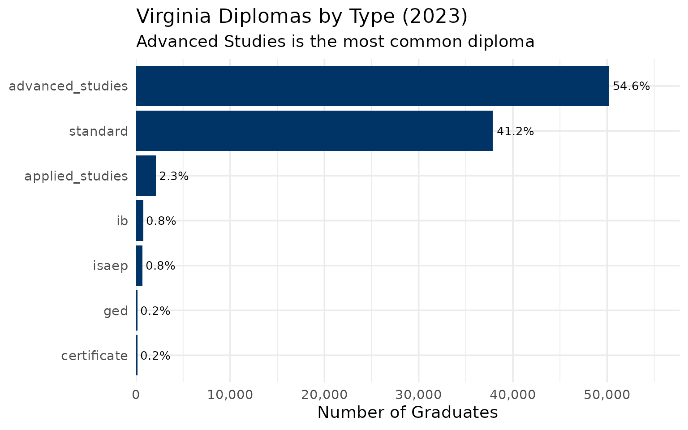

------------------------------------------------------------------------

## 3. Richmond City’s graduation crisis

Richmond City Public Schools graduates just 72% of its students, the
lowest rate among Virginia’s 130 school divisions. Its dropout rate of
24% is more than four times the state average of 5.4%.

``` r
div_grad_23 <- all_grad |>
  filter(is_school, diploma_type == "all", end_year == 2023) |>
  group_by(division_name) |>
  summarize(
    n_schools = n(),
    cohort = sum(cohort_size, na.rm = TRUE),
    graduates = sum(total_graduates, na.rm = TRUE),
    dropouts = sum(dropouts, na.rm = TRUE),
    grad_rate = graduates / cohort,
    .groups = "drop"
  )

richmond_trend <- all_grad |>
  filter(is_school, diploma_type == "all", division_name == "Richmond City") |>
  group_by(end_year) |>
  summarize(
    cohort = sum(cohort_size, na.rm = TRUE),
    graduates = sum(total_graduates, na.rm = TRUE),
    dropouts = sum(dropouts, na.rm = TRUE),
    grad_rate = graduates / cohort,
    .groups = "drop"
  )

richmond_trend |>
  mutate(grad_pct = round(grad_rate * 100, 1))
#> # A tibble: 5 × 6
#>   end_year cohort graduates dropouts grad_rate grad_pct
#>      <int>  <int>     <int>    <int>     <dbl>    <dbl>
#> 1     2019   1514      1073      364     0.709     70.9
#> 2     2020   1495      1066      350     0.713     71.3
#> 3     2021   1472      1155      222     0.785     78.5
#> 4     2022   1360      1008      272     0.741     74.1
#> 5     2023   1483      1073      353     0.724     72.4
```

``` r
stopifnot(nrow(richmond_trend) > 0)

ggplot(richmond_trend, aes(x = end_year, y = grad_rate)) +
  geom_line(linewidth = 1.2, color = "#B22222") +
  geom_point(size = 3, color = "#B22222") +
  geom_hline(yintercept = 0.9193, linetype = "dashed", alpha = 0.5) +
  annotate("text", x = 2022, y = 0.93, label = "State average (91.9%)", size = 3.5) +
  scale_y_continuous(labels = scales::percent, limits = c(0.65, 0.96)) +
  labs(
    title = "Richmond City Graduation Rate (2019-2023)",
    subtitle = "Persistently below state average, with a brief COVID-era bump",
    x = "Cohort Year",
    y = "Graduation Rate"
  )
```

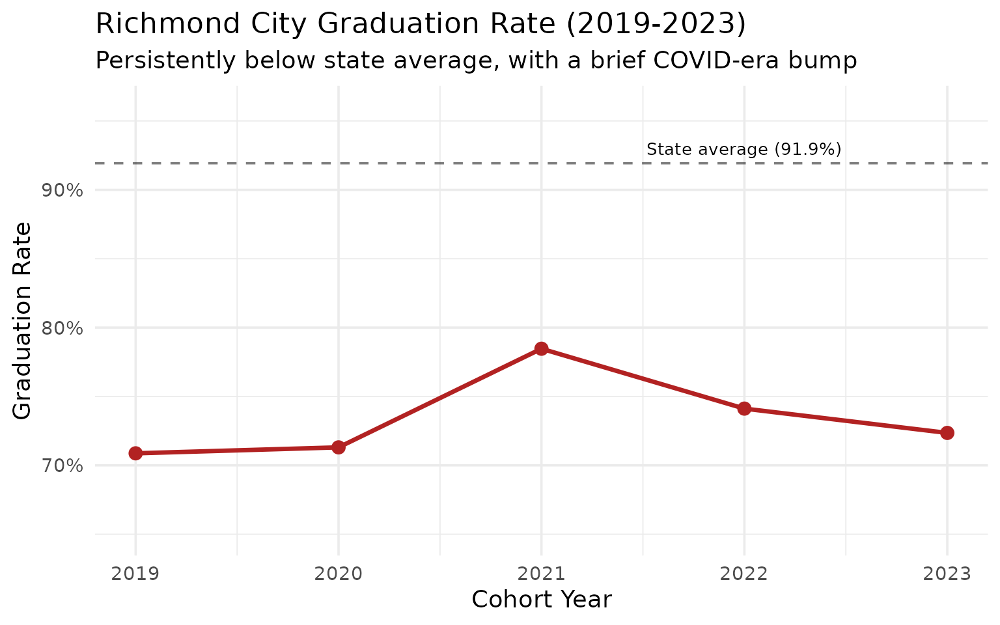

------------------------------------------------------------------------

## 4. Loudoun County leads Northern Virginia in graduation rates

Among NoVA’s four largest divisions, Loudoun County consistently
graduates the highest share of students at 96.7%, followed by Arlington
(93.5%), Fairfax (93.4%), and Prince William (91.7%).

``` r
nova_grad <- all_grad |>
  filter(is_school, diploma_type == "all",
         division_name %in% c("Fairfax County", "Loudoun County",
                               "Prince William County", "Arlington County")) |>
  group_by(end_year, division_name) |>
  summarize(
    cohort = sum(cohort_size, na.rm = TRUE),
    graduates = sum(total_graduates, na.rm = TRUE),
    grad_rate = graduates / cohort,
    .groups = "drop"
  )

nova_grad |>
  filter(end_year == 2023) |>
  arrange(desc(grad_rate)) |>
  mutate(grad_pct = round(grad_rate * 100, 1))
#> # A tibble: 4 × 6
#>   end_year division_name         cohort graduates grad_rate grad_pct
#>      <int> <chr>                  <int>     <int>     <dbl>    <dbl>
#> 1     2023 Loudoun County          6688      6468     0.967     96.7
#> 2     2023 Arlington County        1991      1862     0.935     93.5
#> 3     2023 Fairfax County         14907     13923     0.934     93.4
#> 4     2023 Prince William County   7161      6566     0.917     91.7
```

``` r
stopifnot(nrow(nova_grad) > 0)

ggplot(nova_grad, aes(x = end_year, y = grad_rate, color = division_name)) +
  geom_line(linewidth = 1.2) +
  geom_point(size = 2) +
  scale_y_continuous(labels = scales::percent, limits = c(0.88, 1.0)) +
  scale_color_brewer(palette = "Set1") +
  labs(
    title = "Northern Virginia Graduation Rates (2019-2023)",
    subtitle = "Loudoun County leads the region",
    x = "Cohort Year",
    y = "Graduation Rate",
    color = "Division"
  )
```

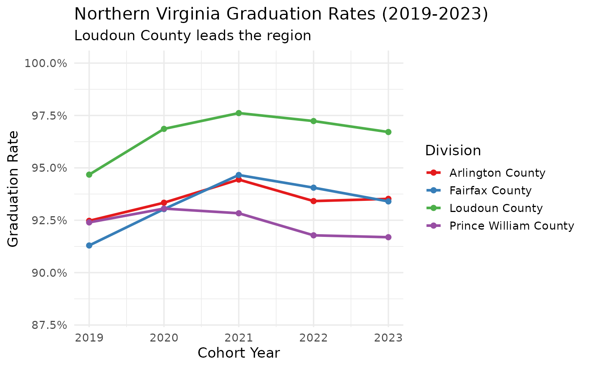

------------------------------------------------------------------------

## 5. COVID drove dropout rates to a five-year low

Virginia’s dropout rate fell from 5.5% in 2019 to 4.3% in 2021, possibly
reflecting emergency pandemic policies that kept students enrolled. By
2023, dropout rates had rebounded to 5.4%.

``` r
dropout_trend <- all_grad |>
  filter(is_state, diploma_type == "all") |>
  select(end_year, graduation_rate, dropout_rate) |>
  mutate(
    grad_pct = round(graduation_rate * 100, 2),
    dropout_pct = round(dropout_rate * 100, 2)
  )

dropout_trend
#> # A tibble: 5 × 5
#>   end_year graduation_rate dropout_rate grad_pct dropout_pct
#>      <int>           <dbl>        <dbl>    <dbl>       <dbl>
#> 1     2019           0.916       0.0551     91.6        5.51
#> 2     2020           0.925       0.0509     92.5        5.09
#> 3     2021           0.930       0.0425     93.0        4.25
#> 4     2022           0.922       0.0515     92.2        5.15
#> 5     2023           0.919       0.0538     91.9        5.38
```

``` r
stopifnot(nrow(dropout_trend) > 0)

ggplot(dropout_trend, aes(x = end_year, y = dropout_rate)) +
  geom_line(linewidth = 1.2, color = "#D32F2F") +
  geom_point(size = 3, color = "#D32F2F") +
  geom_vline(xintercept = 2021, linetype = "dashed", alpha = 0.5) +
  annotate("text", x = 2021.3, y = 0.052, label = "2021\npandemic\npolicies", size = 3) +
  scale_y_continuous(labels = scales::percent) +
  labs(
    title = "Virginia Statewide Dropout Rate (2019-2023)",
    subtitle = "Pandemic-era policies temporarily reduced dropouts",
    x = "Cohort Year",
    y = "Dropout Rate"
  )
```

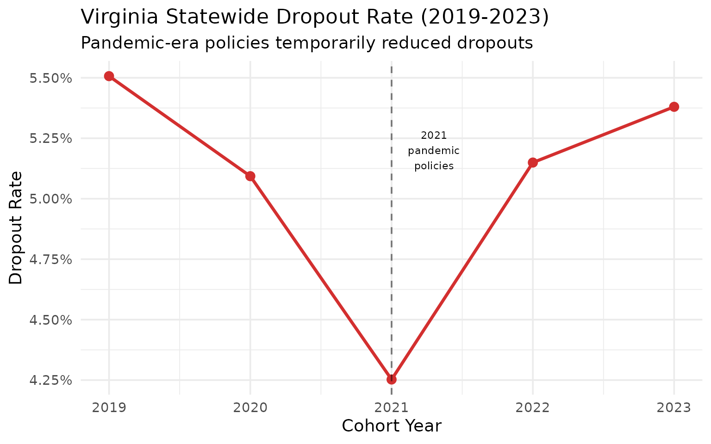

------------------------------------------------------------------------

## 6. Thomas Jefferson: Virginia’s 100% graduation factory

Thomas Jefferson High School for Science and Technology (TJHSST) in
Fairfax County has graduated 100% of its cohort for four consecutive
years (2020-2023). With 459 students in its 2023 cohort, it is the
largest school in Virginia with a perfect graduation rate.

``` r
tj <- all_grad |>
  filter(is_school, diploma_type == "all",
         grepl("Thomas Jefferson High for Science", school_name)) |>
  select(end_year, school_name, graduation_rate, cohort_size)

tj
#> # A tibble: 5 × 4
#>   end_year school_name                               graduation_rate cohort_size
#>      <int> <chr>                                               <dbl>       <int>
#> 1     2019 Thomas Jefferson High for Science and Te…           0.998         427
#> 2     2020 Thomas Jefferson High for Science and Te…           1             443
#> 3     2021 Thomas Jefferson High for Science and Te…           1             436
#> 4     2022 Thomas Jefferson High for Science and Te…           1             452
#> 5     2023 Thomas Jefferson High for Science and Te…           1             459
```

``` r
perfect <- all_grad |>
  filter(is_school, diploma_type == "all", end_year == 2023,
         graduation_rate == 1.0, cohort_size >= 30) |>
  select(school_name, division_name, cohort_size) |>
  arrange(desc(cohort_size))

perfect
#> # A tibble: 7 × 3
#>   school_name                                      division_name     cohort_size
#>   <chr>                                            <chr>                   <int>
#> 1 Thomas Jefferson High for Science and Technology Fairfax County            459
#> 2 Tabb High                                        York County               280
#> 3 Grayson County High                              Grayson County            116
#> 4 Green Run Collegiate                             Virginia Beach C…          72
#> 5 Achievable Dream Middle/High                     Newport News City          47
#> 6 Open High                                        Richmond City              46
#> 7 Richmond Community High                          Richmond City              40
```

------------------------------------------------------------------------

## 7. Hampton Roads: Norfolk is the outlier

Among Hampton Roads’ five largest divisions, Norfolk City graduates just
82% of its students, lagging 10+ points behind neighbors like Hampton
City (96.4%) and Virginia Beach (95.3%).

``` r
hr_divisions <- c("Virginia Beach City", "Norfolk City",
                   "Newport News City", "Hampton City", "Chesapeake City")

hr_grad <- all_grad |>
  filter(is_school, diploma_type == "all",
         division_name %in% hr_divisions) |>
  group_by(end_year, division_name) |>
  summarize(
    cohort = sum(cohort_size, na.rm = TRUE),
    graduates = sum(total_graduates, na.rm = TRUE),
    grad_rate = graduates / cohort,
    .groups = "drop"
  )

hr_grad |>
  filter(end_year == 2023) |>
  arrange(desc(grad_rate)) |>
  mutate(grad_pct = round(grad_rate * 100, 1))
#> # A tibble: 5 × 6
#>   end_year division_name       cohort graduates grad_rate grad_pct
#>      <int> <chr>                <int>     <int>     <dbl>    <dbl>
#> 1     2023 Hampton City          1461      1408     0.964     96.4
#> 2     2023 Virginia Beach City   5111      4873     0.953     95.3
#> 3     2023 Newport News City     1745      1645     0.943     94.3
#> 4     2023 Chesapeake City       3294      3037     0.922     92.2
#> 5     2023 Norfolk City          1800      1475     0.819     81.9
```

``` r
stopifnot(nrow(hr_grad) > 0)

ggplot(hr_grad, aes(x = end_year, y = grad_rate, color = division_name)) +
  geom_line(linewidth = 1.2) +
  geom_point(size = 2) +
  scale_y_continuous(labels = scales::percent, limits = c(0.75, 1.0)) +
  scale_color_brewer(palette = "Set2") +
  labs(
    title = "Hampton Roads Graduation Rates (2019-2023)",
    subtitle = "Norfolk City trails the region by a wide margin",
    x = "Cohort Year",
    y = "Graduation Rate",
    color = "Division"
  )
```

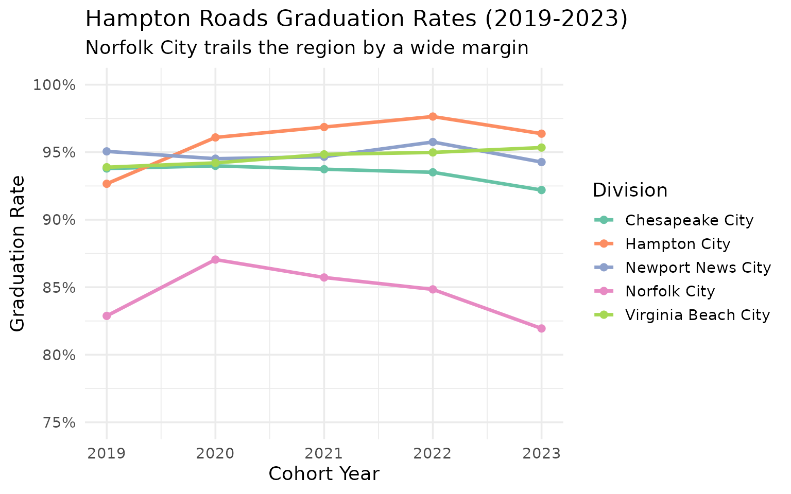

------------------------------------------------------------------------

## 8. Southwest Virginia coalfield schools defy decline narratives

Despite losing population, Southwest Virginia’s rural schools maintain
strong graduation rates. Wise County graduates 98.3% of its students,
higher than Fairfax County (93.4%) or any other NoVA division.

``` r
swva_divisions <- c("Lee County", "Dickenson County", "Buchanan County",
                     "Wise County", "Tazewell County")

swva_grad <- all_grad |>
  filter(is_school, diploma_type == "all",
         division_name %in% swva_divisions) |>
  group_by(end_year, division_name) |>
  summarize(
    cohort = sum(cohort_size, na.rm = TRUE),
    graduates = sum(total_graduates, na.rm = TRUE),
    grad_rate = graduates / cohort,
    .groups = "drop"
  )

swva_grad |>
  filter(end_year == 2023) |>
  arrange(desc(grad_rate)) |>
  mutate(grad_pct = round(grad_rate * 100, 1))
#> # A tibble: 5 × 6
#>   end_year division_name    cohort graduates grad_rate grad_pct
#>      <int> <chr>             <int>     <int>     <dbl>    <dbl>
#> 1     2023 Wise County         405       398     0.983     98.3
#> 2     2023 Tazewell County     425       401     0.944     94.4
#> 3     2023 Dickenson County    160       144     0.9       90  
#> 4     2023 Buchanan County     188       169     0.899     89.9
#> 5     2023 Lee County          199       168     0.844     84.4
```

``` r
stopifnot(nrow(swva_grad) > 0)

ggplot(swva_grad, aes(x = end_year, y = grad_rate, color = division_name)) +
  geom_line(linewidth = 1.2) +
  geom_point(size = 2) +
  scale_y_continuous(labels = scales::percent, limits = c(0.75, 1.0)) +
  scale_color_brewer(palette = "Dark2") +
  labs(
    title = "Southwest Virginia Coalfield Graduation Rates (2019-2023)",
    subtitle = "Small coalfield divisions graduate at high rates despite population loss",
    x = "Cohort Year",
    y = "Graduation Rate",
    color = "Division"
  )
```

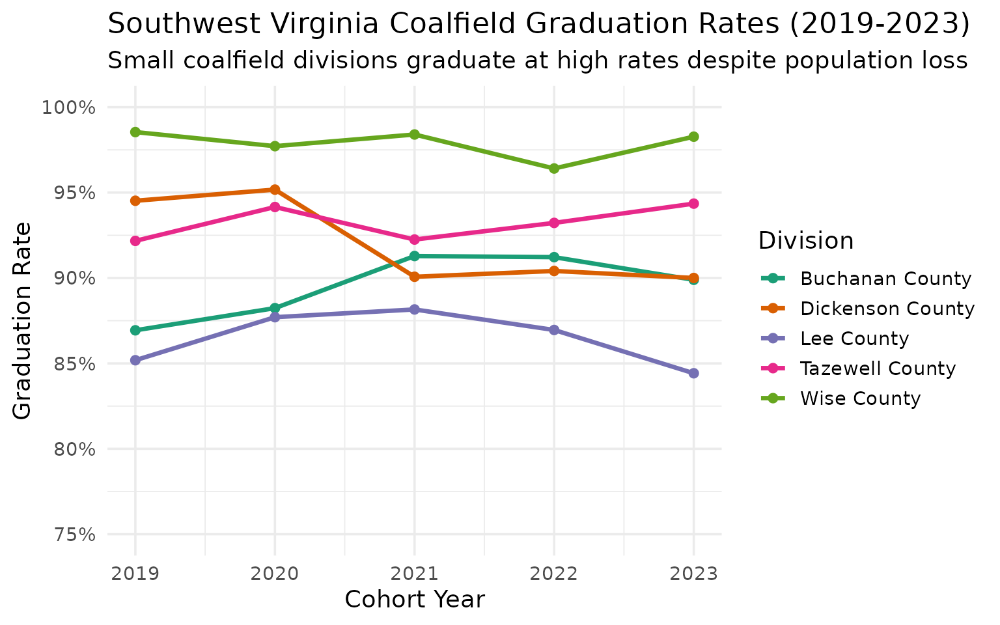

------------------------------------------------------------------------

## 9. Virginia’s largest high schools are all in Northern Virginia

Alexandria City High School leads the state with 1,138 seniors in its
2023 cohort. Eight of the ten largest high schools are in Fairfax,
Prince William, or Arlington counties.

``` r
big_schools <- all_grad |>
  filter(is_school, diploma_type == "all", end_year == 2023) |>
  arrange(desc(cohort_size)) |>
  select(school_name, division_name, cohort_size, graduation_rate) |>
  head(10) |>
  mutate(grad_pct = round(graduation_rate * 100, 1))

big_schools
#> # A tibble: 10 × 5
#>    school_name                division_name cohort_size graduation_rate grad_pct
#>    <chr>                      <chr>               <int>           <dbl>    <dbl>
#>  1 Alexandria City High Scho… Alexandria C…        1138           0.831     83.1
#>  2 Lake Braddock Secondary    Fairfax Coun…         722           0.983     98.3
#>  3 Charles J. Colgan Sr. High Prince Willi…         709           0.982     98.2
#>  4 Chantilly High             Fairfax Coun…         703           0.970     97  
#>  5 West Potomac High          Fairfax Coun…         694           0.955     95.5
#>  6 Oakton High                Fairfax Coun…         690           0.971     97.1
#>  7 Washington-Liberty High    Arlington Co…         682           0.922     92.2
#>  8 Yorktown High              Arlington Co…         678           0.979     97.9
#>  9 Osbourn Park High          Prince Willi…         672           0.921     92.1
#> 10 Unity Reed High            Prince Willi…         666           0.793     79.3
```

``` r
stopifnot(nrow(big_schools) > 0)

big_schools |>
  mutate(school_label = paste0(school_name, " (", division_name, ")"),
         school_label = forcats::fct_reorder(school_label, cohort_size)) |>
  ggplot(aes(x = cohort_size, y = school_label)) +
  geom_col(fill = "#003366") +
  geom_text(aes(label = paste0(grad_pct, "%")), hjust = -0.1, size = 3) +
  scale_x_continuous(expand = expansion(mult = c(0, 0.15))) +
  labs(
    title = "Virginia's 10 Largest High Schools by Cohort (2023)",
    subtitle = "Labels show graduation rate",
    x = "Cohort Size",
    y = NULL
  )
```

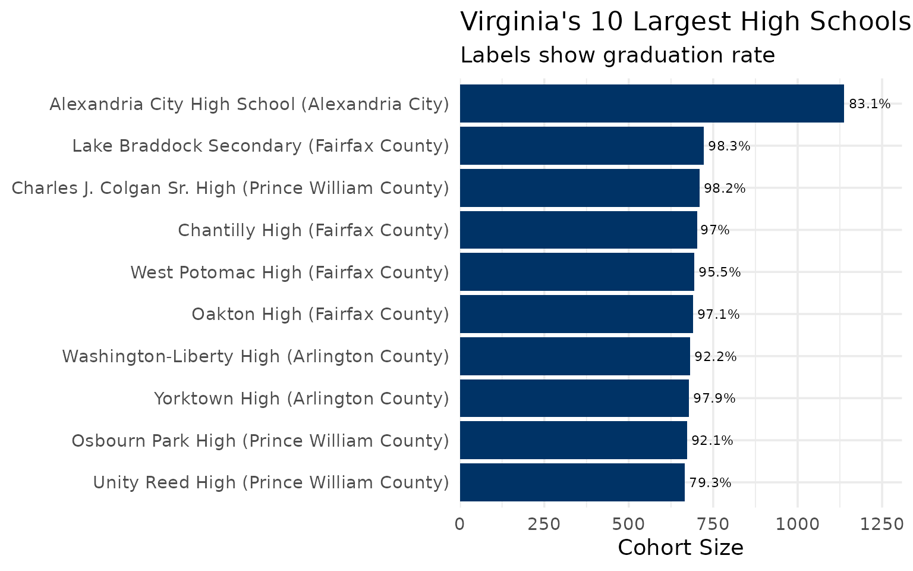

------------------------------------------------------------------------

## 10. Virginia loses 5,300 students to dropout every year

Over the 2019-2023 period, Virginia averaged roughly 5,000 dropouts per
year. The 2021 pandemic-policy dip to 4,129 was temporary; 2023 saw
5,319 dropouts.

``` r
dropout_counts <- all_grad |>
  filter(is_state, diploma_type == "all") |>
  select(end_year, cohort_size, total_graduates, dropouts, still_enrolled) |>
  mutate(
    dropout_pct = round(dropouts / cohort_size * 100, 1),
    still_enrolled_pct = round(still_enrolled / cohort_size * 100, 1)
  )

dropout_counts
#> # A tibble: 5 × 7
#>   end_year cohort_size total_graduates dropouts still_enrolled dropout_pct
#>      <int>       <int>           <int>    <int>          <int>       <dbl>
#> 1     2019       98241           89991     5410           1330         5.5
#> 2     2020       98327           90971     5008           1100         5.1
#> 3     2021       97096           90325     4129           1632         4.3
#> 4     2022       98281           90603     5061           1348         5.1
#> 5     2023       98927           90944     5319           1330         5.4
#> # ℹ 1 more variable: still_enrolled_pct <dbl>
```

``` r
stopifnot(nrow(dropout_counts) > 0)

dropout_long <- dropout_counts |>
  select(end_year, Dropouts = dropouts, `Still Enrolled` = still_enrolled) |>
  pivot_longer(cols = -end_year, names_to = "outcome", values_to = "count")

ggplot(dropout_long, aes(x = end_year, y = count, fill = outcome)) +
  geom_col(position = "dodge") +
  scale_y_continuous(labels = scales::comma) +
  scale_fill_manual(values = c("Dropouts" = "#D32F2F", "Still Enrolled" = "#FF9800")) +
  labs(
    title = "Virginia Non-Graduates by Outcome (2019-2023)",
    subtitle = "Students who left high school without graduating",
    x = "Cohort Year",
    y = "Number of Students",
    fill = NULL
  )
```

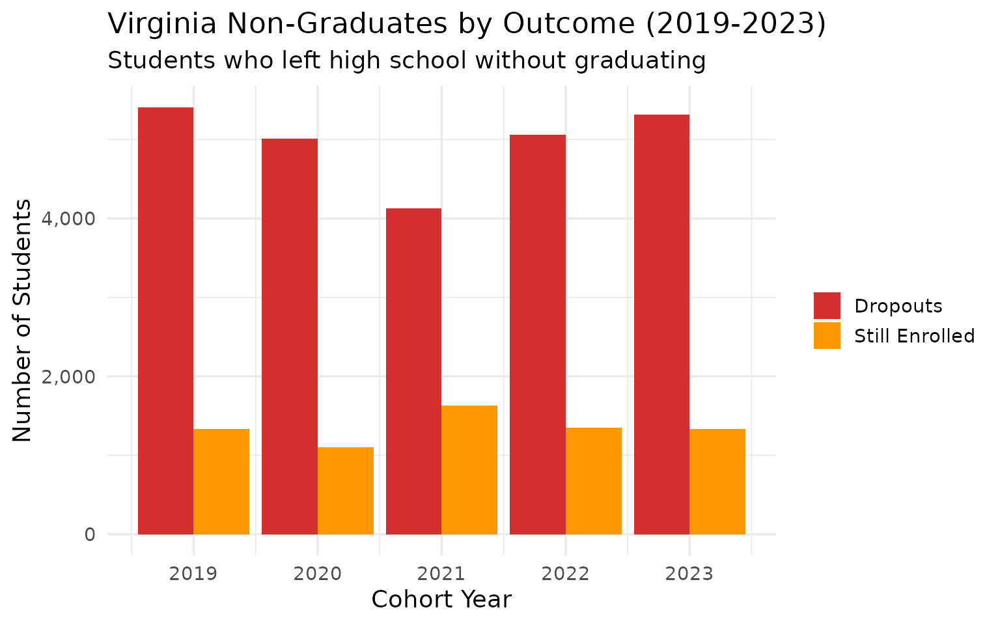

------------------------------------------------------------------------

## 11. Alexandria City High: one school, 1,138 seniors, 83% graduation

Alexandria City High School is Virginia’s single largest high school by
cohort, yet its 83.1% graduation rate trails the state average by nearly
9 points. As the only public high school in Alexandria City, every
student funnels through one building.

``` r
alex <- all_grad |>
  filter(is_school, diploma_type == "all",
         grepl("Alexandria City High", school_name)) |>
  select(end_year, school_name, cohort_size, graduation_rate, dropout_rate) |>
  mutate(grad_pct = round(graduation_rate * 100, 1))

alex
#> # A tibble: 2 × 6
#>   end_year school_name         cohort_size graduation_rate dropout_rate grad_pct
#>      <int> <chr>                     <int>           <dbl>        <dbl>    <dbl>
#> 1     2022 Alexandria City Hi…         993           0.833       0.0876     83.3
#> 2     2023 Alexandria City Hi…        1138           0.831       0.128      83.1
```

``` r
stopifnot(nrow(alex) > 0)

ggplot(alex, aes(x = end_year)) +
  geom_col(aes(y = cohort_size), fill = "#B0BEC5", alpha = 0.6) +
  geom_line(aes(y = graduation_rate * 1200), color = "#003366", linewidth = 1.2) +
  geom_point(aes(y = graduation_rate * 1200), color = "#003366", size = 3) +
  scale_y_continuous(
    name = "Cohort Size",
    labels = scales::comma,
    sec.axis = sec_axis(~ . / 1200, name = "Graduation Rate", labels = scales::percent)
  ) +
  labs(
    title = "Alexandria City High School (2019-2023)",
    subtitle = "Virginia's largest high school by cohort size",
    x = "Cohort Year"
  )
```

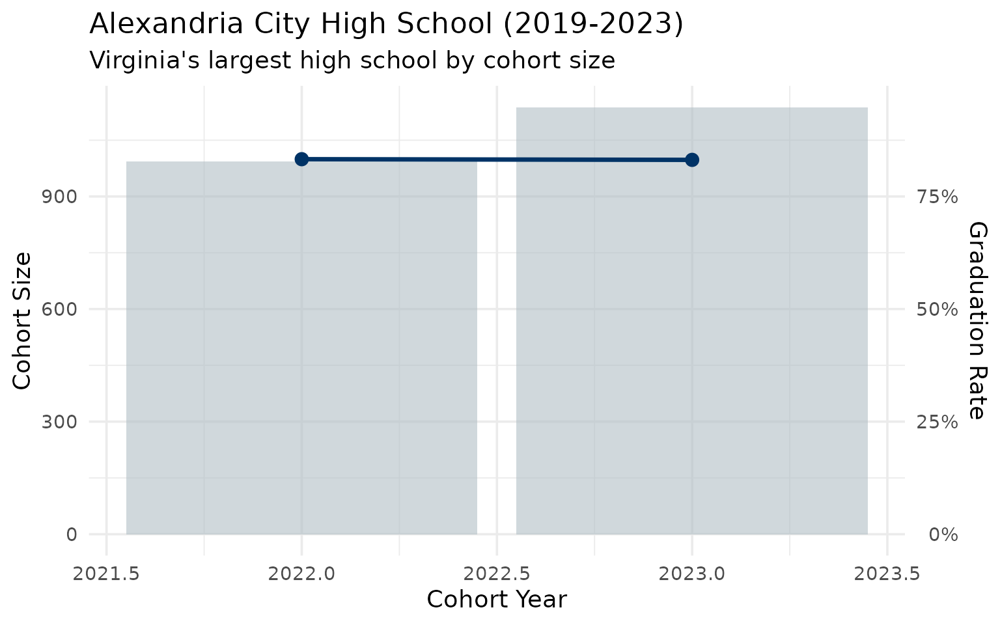

------------------------------------------------------------------------

## 12. Fairfax County alone graduates 14,000 students per year

With 14,907 seniors in its 2023 cohort across 30 high schools, Fairfax
County produces more graduates than many states. Its graduation rate has
climbed from 91.3% in 2019 to 93.4% in 2023.

``` r
fairfax <- all_grad |>
  filter(is_school, diploma_type == "all",
         division_name == "Fairfax County") |>
  group_by(end_year) |>
  summarize(
    n_schools = n(),
    cohort = sum(cohort_size, na.rm = TRUE),
    graduates = sum(total_graduates, na.rm = TRUE),
    grad_rate = graduates / cohort,
    .groups = "drop"
  ) |>
  mutate(grad_pct = round(grad_rate * 100, 1))

fairfax
#> # A tibble: 5 × 6
#>   end_year n_schools cohort graduates grad_rate grad_pct
#>      <int>     <int>  <int>     <int>     <dbl>    <dbl>
#> 1     2019        30  14936     13636     0.913     91.3
#> 2     2020        30  14793     13762     0.930     93  
#> 3     2021        30  14641     13859     0.947     94.7
#> 4     2022        30  14801     13921     0.941     94.1
#> 5     2023        30  14907     13923     0.934     93.4
```

``` r
stopifnot(nrow(fairfax) > 0)

ggplot(fairfax, aes(x = end_year, y = grad_rate)) +
  geom_line(linewidth = 1.2, color = "#2E7D32") +
  geom_point(size = 3, color = "#2E7D32") +
  scale_y_continuous(labels = scales::percent, limits = c(0.88, 0.96)) +
  labs(
    title = "Fairfax County Graduation Rate (2019-2023)",
    subtitle = "30 high schools, 14,900+ seniors per year",
    x = "Cohort Year",
    y = "Graduation Rate"
  )
```

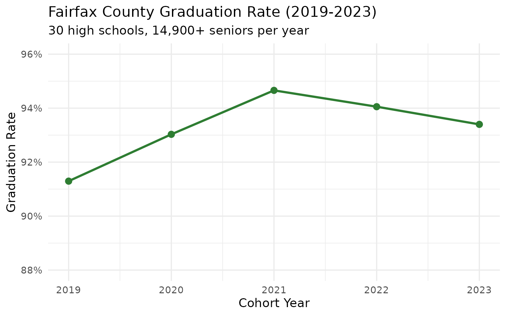

------------------------------------------------------------------------

## 13. The biggest school-level improvements since 2019

Lancaster High School improved its graduation rate by 14 percentage
points between 2019 and 2023 (from 83.8% to 97.8%). Armstrong High in
Richmond jumped nearly 12 points.

``` r
improvement <- all_grad |>
  filter(is_school, diploma_type == "all", end_year %in% c(2019, 2023)) |>
  select(end_year, school_name, division_name, graduation_rate, cohort_size) |>
  pivot_wider(names_from = end_year, values_from = c(graduation_rate, cohort_size)) |>
  filter(!is.na(graduation_rate_2019), !is.na(graduation_rate_2023),
         cohort_size_2023 >= 50) |>
  mutate(change = round((graduation_rate_2023 - graduation_rate_2019) * 100, 1)) |>
  arrange(desc(change)) |>
  head(10)

improvement |>
  select(school_name, division_name, graduation_rate_2019, graduation_rate_2023,
         change, cohort_size_2023) |>
  mutate(
    rate_2019 = round(graduation_rate_2019 * 100, 1),
    rate_2023 = round(graduation_rate_2023 * 100, 1)
  )
#> # A tibble: 10 × 8
#>    school_name    division_name graduation_rate_2019 graduation_rate_2023 change
#>    <chr>          <chr>                        <dbl>                <dbl>  <dbl>
#>  1 Lancaster High Lancaster Co…               0.838                 0.978   13.9
#>  2 Osbourn High   Manassas City               0.777                 0.895   11.8
#>  3 Armstrong High Richmond City               0.652                 0.770   11.8
#>  4 Amherst Count… Amherst Coun…               0.862                 0.960    9.8
#>  5 Huguenot High  Richmond City               0.682                 0.780    9.8
#>  6 Rustburg High  Campbell Cou…               0.901                 0.995    9.4
#>  7 Fairfax Count… Fairfax Coun…               0.0686                0.153    8.4
#>  8 Phoebus High   Hampton City                0.899                 0.982    8.4
#>  9 West Potomac … Fairfax Coun…               0.872                 0.955    8.3
#> 10 Brunswick High Brunswick Co…               0.8                   0.881    8.1
#> # ℹ 3 more variables: cohort_size_2023 <int>, rate_2019 <dbl>, rate_2023 <dbl>
```

``` r
stopifnot(nrow(improvement) > 0)

improvement |>
  mutate(school_label = paste0(school_name, " (", division_name, ")"),
         school_label = forcats::fct_reorder(school_label, change)) |>
  ggplot(aes(x = change, y = school_label)) +
  geom_col(fill = "#4CAF50") +
  geom_text(aes(label = paste0("+", change, " pp")), hjust = -0.1, size = 3) +
  scale_x_continuous(expand = expansion(mult = c(0, 0.2))) +
  labs(
    title = "Biggest Graduation Rate Improvements (2019 to 2023)",
    subtitle = "Schools with 50+ seniors in 2023 cohort",
    x = "Percentage Point Change",
    y = NULL
  )
```

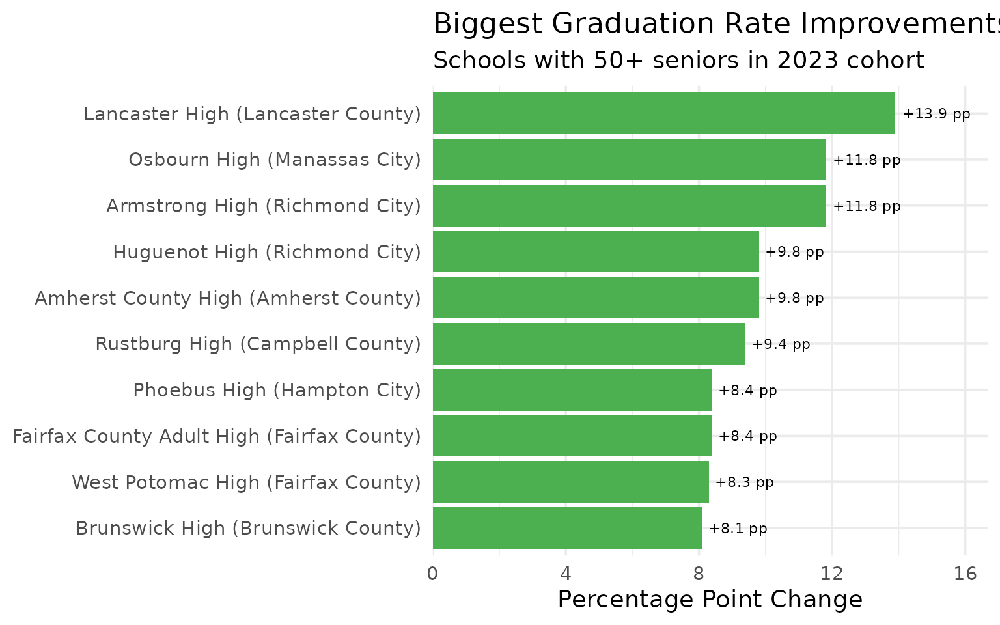

------------------------------------------------------------------------

## 14. Division-level graduation gap: 72% to 100%

Virginia’s 130 school divisions span a 28-point graduation rate gap.
Grayson County and Clarke County graduate nearly 100% of students, while
Richmond City and Danville graduate fewer than 75%.

``` r
div_grad <- all_grad |>
  filter(is_school, diploma_type == "all", end_year == 2023) |>
  group_by(division_name) |>
  summarize(
    cohort = sum(cohort_size, na.rm = TRUE),
    graduates = sum(total_graduates, na.rm = TRUE),
    grad_rate = graduates / cohort,
    .groups = "drop"
  ) |>
  filter(cohort >= 50)

cat("Top 5 divisions:\n")
#> Top 5 divisions:
div_grad |> arrange(desc(grad_rate)) |>
  head(5) |>
  mutate(grad_pct = round(grad_rate * 100, 1))
#> # A tibble: 5 × 5
#>   division_name     cohort graduates grad_rate grad_pct
#>   <chr>              <int>     <int>     <dbl>    <dbl>
#> 1 Grayson County       116       116     1        100  
#> 2 Clarke County        146       145     0.993     99.3
#> 3 Norton City           67        66     0.985     98.5
#> 4 Falls Church City    200       197     0.985     98.5
#> 5 Bland County          65        64     0.985     98.5

cat("\nBottom 5 divisions:\n")
#> 
#> Bottom 5 divisions:
div_grad |> arrange(grad_rate) |>
  head(5) |>
  mutate(grad_pct = round(grad_rate * 100, 1))
#> # A tibble: 5 × 5
#>   division_name        cohort graduates grad_rate grad_pct
#>   <chr>                 <int>     <int>     <dbl>    <dbl>
#> 1 Richmond City          1483      1073     0.724     72.4
#> 2 Danville City           393       288     0.733     73.3
#> 3 Prince Edward County    157       126     0.803     80.3
#> 4 Fredericksburg City     270       219     0.811     81.1
#> 5 Norfolk City           1800      1475     0.819     81.9
```

``` r
stopifnot(nrow(div_grad) > 0)

extremes <- bind_rows(
  div_grad |> arrange(desc(grad_rate)) |> head(5) |> mutate(group = "Top 5"),
  div_grad |> arrange(grad_rate) |> head(5) |> mutate(group = "Bottom 5")
)

extremes |>
  mutate(division_name = forcats::fct_reorder(division_name, grad_rate)) |>
  ggplot(aes(x = grad_rate, y = division_name, fill = group)) +
  geom_col() +
  scale_x_continuous(labels = scales::percent, limits = c(0, 1.05)) +
  scale_fill_manual(values = c("Top 5" = "#2E7D32", "Bottom 5" = "#D32F2F")) +
  labs(
    title = "Virginia Division Graduation Rates: Top and Bottom 5 (2023)",
    subtitle = "Among divisions with 50+ seniors",
    x = "Graduation Rate",
    y = NULL,
    fill = NULL
  )
```

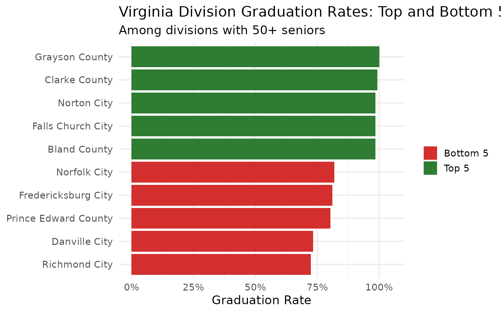

------------------------------------------------------------------------

## 15. Five years, 490,000 graduates

From 2019 to 2023, Virginia graduated 452,834 students across five
cohorts totaling 490,872 seniors. The state maintains roughly 320 high
schools.

``` r
summary_stats <- all_grad |>
  filter(is_state, diploma_type == "all") |>
  summarize(
    years = n(),
    total_cohort = sum(cohort_size, na.rm = TRUE),
    total_graduates = sum(total_graduates, na.rm = TRUE),
    total_dropouts = sum(dropouts, na.rm = TRUE),
    avg_grad_rate = round(mean(graduation_rate) * 100, 1)
  )

summary_stats
#> # A tibble: 1 × 5
#>   years total_cohort total_graduates total_dropouts avg_grad_rate
#>   <int>        <int>           <int>          <int>         <dbl>
#> 1     5       490872          452834          24927          92.3

school_counts <- all_grad |>
  filter(is_school, diploma_type == "all") |>
  group_by(end_year) |>
  summarize(n_schools = n_distinct(school_name), .groups = "drop")

school_counts
#> # A tibble: 5 × 2
#>   end_year n_schools
#>      <int>     <int>
#> 1     2019       316
#> 2     2020       318
#> 3     2021       317
#> 4     2022       316
#> 5     2023       320
```

``` r
yearly_summary <- all_grad |>
  filter(is_state, diploma_type == "all") |>
  select(end_year, cohort_size, total_graduates)

stopifnot(nrow(yearly_summary) > 0)

yearly_long <- yearly_summary |>
  pivot_longer(cols = c(cohort_size, total_graduates),
               names_to = "measure", values_to = "count") |>
  mutate(measure = ifelse(measure == "cohort_size", "Cohort", "Graduates"))

ggplot(yearly_long, aes(x = end_year, y = count, fill = measure)) +
  geom_col(position = "dodge") +
  scale_y_continuous(labels = scales::comma) +
  scale_fill_manual(values = c("Cohort" = "#B0BEC5", "Graduates" = "#003366")) +
  labs(
    title = "Virginia Cohort Size vs. Graduates (2019-2023)",
    subtitle = "490,000+ seniors over five years",
    x = "Cohort Year",
    y = "Number of Students",
    fill = NULL
  )
```

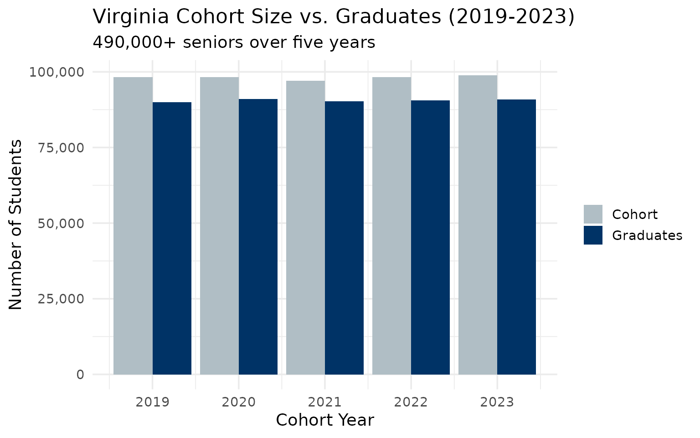

------------------------------------------------------------------------

## Summary

Virginia’s graduation data reveals:

- **Steady state rate**: 91.6%-93.0% graduation rate, well above the
  national average
- **Advanced Studies dominance**: More than half of graduates earn the
  rigorous Advanced Studies diploma
- **Richmond’s challenge**: At 72%, the capital city lags the state by
  nearly 20 points
- **NoVA strength**: Loudoun County leads at 96.7%, but even Fairfax
  (93.4%) has risen steadily
- **Coalfield resilience**: Southwest Virginia divisions like Wise
  County (98.3%) outperform NoVA
- **COVID effect**: The 2021 cohort saw the highest graduation rate and
  lowest dropout rate
- **5,300 annual dropouts**: Virginia still loses thousands of students
  before graduation each year

------------------------------------------------------------------------

## Data Notes

**Enrollment data source**: Virginia Department of Education (VDOE)
School Quality Profiles

**Graduation data source**: VDOE Open Data Portal (Cohort Graduation and
Dropout Report)

**Available years**: Enrollment 2016-2024 (9 years); Graduation
2019-2023 (5 years)

**Entities**: State, 132 school divisions (Virginia’s term for
districts), ~2,100 schools (enrollment), ~320 high schools (graduation)

**Enrollment subgroups**: Total enrollment, race/ethnicity (white,
black, Hispanic, Asian, multiracial, Native American, Pacific Islander),
gender

**Graduation data**: 4-year cohort graduation rate, dropout rate,
completion rate, diploma types (Advanced Studies, Standard, IB, Applied
Studies, GED, ISAEP, Certificate)

**Suppression**: Small counts suppressed for student privacy (marked as
`<` in raw data, `NA` in processed data)

**Census Day**: Fall membership count (typically late September/early
October)

**CAPTCHA note**: VDOE’s School Quality Profiles site occasionally
requires CAPTCHA verification for enrollment data. When this happens,
use `use_cache = TRUE` (default) to rely on locally cached data.
Graduation data is always available via the Open Data Portal.

------------------------------------------------------------------------

*Data sourced from the Virginia Department of Education (VDOE).*

------------------------------------------------------------------------

## Session Info

``` r
sessionInfo()
#> R version 4.5.2 (2025-10-31)
#> Platform: x86_64-pc-linux-gnu
#> Running under: Ubuntu 24.04.3 LTS
#> 
#> Matrix products: default
#> BLAS:   /usr/lib/x86_64-linux-gnu/openblas-pthread/libblas.so.3 
#> LAPACK: /usr/lib/x86_64-linux-gnu/openblas-pthread/libopenblasp-r0.3.26.so;  LAPACK version 3.12.0
#> 
#> locale:
#>  [1] LC_CTYPE=C.UTF-8       LC_NUMERIC=C           LC_TIME=C.UTF-8       
#>  [4] LC_COLLATE=C.UTF-8     LC_MONETARY=C.UTF-8    LC_MESSAGES=C.UTF-8   
#>  [7] LC_PAPER=C.UTF-8       LC_NAME=C              LC_ADDRESS=C          
#> [10] LC_TELEPHONE=C         LC_MEASUREMENT=C.UTF-8 LC_IDENTIFICATION=C   
#> 
#> time zone: UTC
#> tzcode source: system (glibc)
#> 
#> attached base packages:
#> [1] stats     graphics  grDevices utils     datasets  methods   base     
#> 
#> other attached packages:
#> [1] ggplot2_4.0.2      tidyr_1.3.2        dplyr_1.2.0        vaschooldata_0.1.0
#> 
#> loaded via a namespace (and not attached):
#>  [1] utf8_1.2.6         rappdirs_0.3.4     sass_0.4.10        generics_0.1.4    
#>  [5] stringi_1.8.7      hms_1.1.4          digest_0.6.39      magrittr_2.0.4    
#>  [9] evaluate_1.0.5     grid_4.5.2         RColorBrewer_1.1-3 fastmap_1.2.0     
#> [13] jsonlite_2.0.0     httr_1.4.8         purrr_1.2.1        scales_1.4.0      
#> [17] codetools_0.2-20   textshaping_1.0.4  jquerylib_0.1.4    cli_3.6.5         
#> [21] rlang_1.1.7        crayon_1.5.3       bit64_4.6.0-1      withr_3.0.2       
#> [25] cachem_1.1.0       yaml_2.3.12        tools_4.5.2        parallel_4.5.2    
#> [29] tzdb_0.5.0         forcats_1.0.1      curl_7.0.0         vctrs_0.7.1       
#> [33] R6_2.6.1           lifecycle_1.0.5    stringr_1.6.0      fs_1.6.6          
#> [37] bit_4.6.0          vroom_1.7.0        ragg_1.5.0         pkgconfig_2.0.3   
#> [41] desc_1.4.3         pkgdown_2.2.0      pillar_1.11.1      bslib_0.10.0      
#> [45] gtable_0.3.6       glue_1.8.0         systemfonts_1.3.1  xfun_0.56         
#> [49] tibble_3.3.1       tidyselect_1.2.1   knitr_1.51         farver_2.1.2      
#> [53] htmltools_0.5.9    rmarkdown_2.30     labeling_0.4.3     readr_2.2.0       
#> [57] compiler_4.5.2     S7_0.2.1
```
